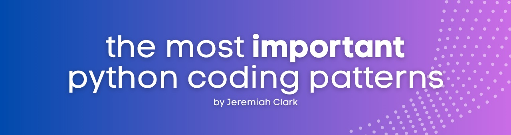

# Python Coding Patterns

A collection of practical Python patterns that will make your code more maintainable, efficient, and professional. Each notebook focuses on real-world scenarios with working examples you can actually use.

## What You'll Learn

### [01 Design Patterns](01_design_patterns.ipynb) - Essential Building Blocks

Master the fundamental patterns that every Python developer should know:

- **Singleton Pattern**: Database connections and configuration management
- **Factory Pattern**: Create different data processors based on file types
- **Builder Pattern**: Build complex reports with optional components
- **Decorator Pattern**: Add caching, logging, and validation to data sources
- **Strategy Pattern**: Switch between different customer analysis algorithms
- **Observer Pattern**: Build reactive systems for stock price monitoring

Each pattern includes performance comparisons and shows you when (and when not) to use them.

### [02 Pythonic Idioms](02_pythonic_idioms.ipynb) - Write Code Like a Python Expert

Learn the idioms that separate good Python from great Python:

- **EAFP vs LBYL**: The Python philosophy that changes how you handle errors
- **Context Managers**: Guarantee resource cleanup with database connections and file operations
- **Comprehensions**: Transform data efficiently with list, dict, and set comprehensions
- **Duck Typing**: Build flexible data sources that work with any object that has the right methods
- **Iteration Protocol**: Create custom iterables for pagination, streaming, and data processing

You'll see performance benchmarks showing why these patterns matter.

### [03 Functional Programming](03_functional_programming_patterns.ipynb) - Reduce Bugs, Increase Clarity

Apply functional programming concepts to write more predictable code:

- **Higher-Order Functions**: Use functions as first-class objects for flexible data processing
- **Immutability**: Build data structures that prevent bugs through immutable design
- **Pure Functions**: Write functions that are easier to test and debug
- **Function Composition**: Chain simple operations to solve complex problems

Includes practical examples of data transformation pipelines and mathematical computations.

### [04 Concurrency & Parallelism](04_concurrency_parallelism_patterns.ipynb) - Make Your Code Actually Faster

Understand when and how to use Python's concurrency options:

- **Producer-Consumer Pattern**: Coordinate work between threads using thread-safe queues
- **Thread Pools**: Handle I/O-bound tasks efficiently with ThreadPoolExecutor
- **Async/Await**: Build high-concurrency applications for thousands of simultaneous operations
- **Process Pools**: Break free from the GIL for CPU-intensive work

Complete with performance comparisons showing the real impact of each approach.

### [05 Data Processing](05_data_processing_analysis_patterns.ipynb) - Handle Data Like a Pro

Learn patterns for processing data efficiently at any scale:

- **ETL Pipelines**: Structure data workflows with proper error handling and logging
- **Vectorization**: Speed up numerical computations by 10-100x using NumPy and pandas
- **Streaming Processing**: Handle datasets larger than memory using generators and iterators
- **Memory Efficiency**: Process large files without running out of RAM

Includes real-world examples with sales data, log processing, and user analytics.

### [06 Testing Patterns](06_testing_patterns.ipynb) - Write Tests That Actually Help

Build test suites that make development faster, not slower:

- **AAA Pattern**: Structure tests that are easy to read and maintain
- **Fixtures**: Set up test environments efficiently with proper cleanup
- **Mocking**: Test your code in isolation by replacing external dependencies
- **Test Organization**: Organize test suites that scale with your codebase

Learn to test databases, APIs, and complex business logic with practical examples.

### [08 Error Handling & Logging](08_error_handling_logging_patterns.ipynb) - Build Resilient Applications

Create applications that handle failures gracefully:

- **Custom Exceptions**: Build exception hierarchies that make debugging easier
- **Retry Patterns**: Handle transient failures with exponential backoff
- **Graceful Degradation**: Keep core functionality working when optional features fail
- **Structured Logging**: Create logs that help you debug production issues

Includes patterns for rate-limiting logs, security-aware logging, and error recovery.

## How to Navigate This Repository

**For specific problems**: Jump directly to the notebook that addresses your current challenge
**For comprehensive learning**: Work through the notebooks in order - each builds on previous concepts
**For hands-on practice**: Every notebook includes working examples and exercises you can modify

## Prerequisites

- Basic Python knowledge (functions, classes, exceptions)
- Familiarity with common data structures (lists, dicts)
- Comfortable running Python scripts and notebooks

## Getting Started

```bash
git clone https://github.com/jeremiahoclark/python-coding-patterns.git
cd python-coding-patterns
pip install jupyter pandas numpy requests aiohttp pytest
jupyter notebook
```

## What Makes This Different

- **Real examples**: Every pattern uses realistic data and scenarios, not abstract toy problems
- **Performance focus**: Benchmarks show you the actual impact of different approaches
- **Production-ready**: These patterns work in real applications, not just tutorials
- **Modern Python**: Uses current best practices and Python 3.7+ features

Start with any notebook that addresses your current needs - each one is designed to provide immediate practical value.